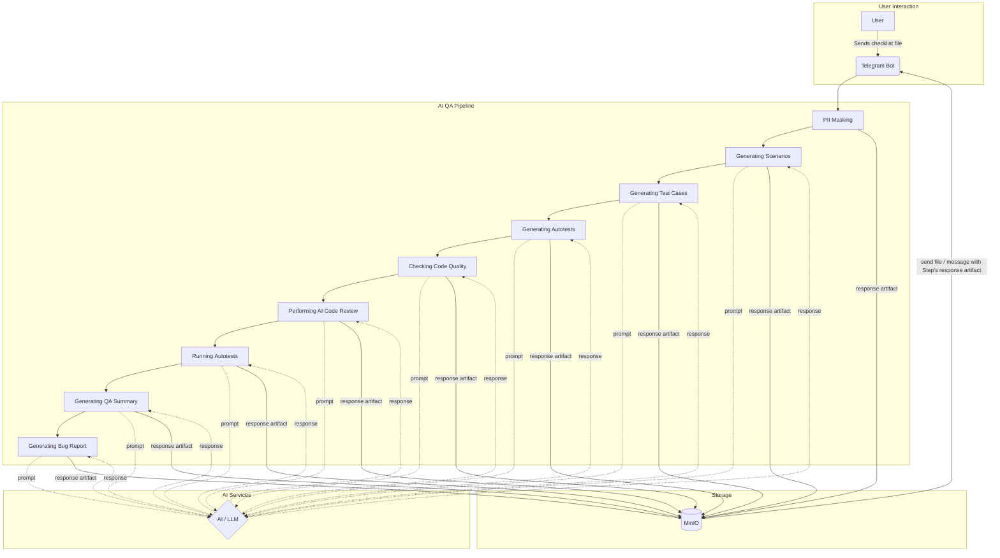

# ChatOps AI QA Pipeline

This project is an AI-powered QA pipeline managed via a Telegram bot (ChatOps). It automates various stages of the QA process, from analyzing requirements to generating bug reports and summary reports.

## Architecture

The project consists of several key components working together in a containerized environment managed by Docker Compose.



1.  **Telegram Bot**: The main interface for user interaction. The bot accepts requirement files, manages the pipeline's execution, and provides artifacts.
2.  **AI/LLM**: The project supports both cloud-based models (defaulting to `gemini-pro` via the Google Gemini API) and local models (e.g., `codegemma:7b` via a local LLM server like Ollama). The model and configuration are selected through environment variables such as `LLM_PROVIDER`, `GEMINI_API_KEY`, `GEMINI_MODEL_NAME`, `LOCAL_MODEL_NAME`, and `LOCAL_LLM_ENDPOINT`.
3.  **AI QA Pipeline**: A sequence of steps for processing requirements and performing QA:
    -   PII Masking
    -   Generating Scenarios
    -   Generating Test Cases
    -   Generating Autotests
    -   Checking Code Quality
    -   Performing AI Code Review
    -   Running Autotests
    -   Generating QA Summary
    -   Generating Bug Report
    Each step is executed as a separate module.
4.  **Artifact Storage (Minio)**: Used for storing both the initial files and all artifacts generated during the process.
5.  **Containerization (Docker)**: All system components (the application and Minio) run in isolated Docker containers, ensuring easy deployment and scalability.

## Project Structure

The project has a modular structure, with each component responsible for its functionality:

-   `bot/`: Contains the logic for the Telegram bot (`main.py`), which handles user commands and manages the state of the AI QA pipeline.
-   `llm/`:
    -   `gemini_client.py`: A client for interacting with the Gemini API.
    -   `prompts/`: Modules with prompts for the AI for each specific step.
-   `pipeline/`:
    -   `runner.py`: Defines the sequence of the AI QA pipeline steps and initializes its execution.
    -   `steps/`: Each file in this directory represents a separate step in the AI QA pipeline (e.g., `generate_scenarios.py`, `ai_code_review.py`).
-   `storage/`: Contains the client for working with the Minio object storage (`minio_client.py`). `minio_setup.py` is used for Minio initialization.
-   `models/`: Defines the data structures used in the project.
-   `logs/`: Configures logging.
-   `artifacts/`:
    -   `{RUN_ID}/`: A unique identifier for each pipeline run.
        -   `autotests/`: Tests for the project, including generated autotests.
        -   `reports/`: Directory for storing reports.

## Getting Started

### Prerequisites

-   Docker
-   Docker Compose
-   Git

### Installation

1.  **Clone the repository:**
    ```bash
    git clone <your_repository_url>
    cd chatops_ai_qa_pipeline
    ```
2.  **Create the `.env` file:**
    Copy `.env.template` to `.env`:
    ```bash
    cp .env.template .env
    ```
    Fill in the variables in the `.env` file.

## Configuration

-   `TELEGRAM_BOT_TOKEN`: Your token for the Telegram bot.
-   **LLM Configuration:**
    -   `LLM_PROVIDER`: Choose `"cloud"` to use the Google Gemini API or `"local"` for a local model (e.g., Ollama). Defaults to `"cloud"`.
    -   If `LLM_PROVIDER="cloud"`:
        -   `GEMINI_API_KEY`: Your API key for Gemini. Get it from Google AI Studio.
        -   `GEMINI_MODEL_NAME`: The name of the cloud-based Gemini model (default: `gemini-pro`).
        -   `GEMINI_TEMPERATURE`: The model's temperature for generating responses (default: `0.7`).
    -   If `LLM_PROVIDER="local"`:
        -   `LOCAL_MODEL_NAME`: The name of your local model (e.g., `codegemma:7b`).
        -   `LOCAL_LLM_ENDPOINT`: The URL of your local LLM endpoint (e.g., `http://host.docker.internal:11434` for Ollama).
            *Note:* If you are using a local model, ensure your local LLM server (e.g., Ollama) is running and accessible.
-   **Minio Configuration:**
    -   `MINIO_ENDPOINT`: The address of the Minio server.
    -   `MINIO_ACCESS_KEY`: The access key for Minio.
    -   `MINIO_SECRET_KEY`: The secret key for Minio.
    -   `MINIO_BUCKET`: The name of the bucket in Minio (default: `qa-pipeline`).
    -   `MINIO_SECURE`: Set to `"true"` for HTTPS, `"false"` for HTTP (Minio typically uses HTTP).

*Note:* The environment variables from the `.env` file are passed as build arguments to the `app` service during the Docker build process. This ensures that your credentials and other configurations are securely passed to the container.

### Running the Application

```bash
docker-compose up --build
```

This command will build the Docker image for the application and start the containers for the application and Minio.

## Usage

1.  **Open Telegram and find your bot.**
2. **After the welcome message, you will receive an example `checklist_login.txt` file.** Forward this file back to the bot to start, or upload your own `.txt` file with checklist.
3.  **The bot will initialize the pipeline.** You will see a message indicating the start of the process and buttons for control.
4.  **Run the AI QA pipeline steps** by clicking the `▶️ Run: ...` button.
5.  **Download artifacts** by clicking the `📄 Download Artifacts` button. The artifacts will be sent to you in the chat.
6.  After all steps are completed, you can close the AI QA pipeline or cancel it at any time.

### Stopping the Application

To stop all services, run:
```bash
docker-compose down
```

## How to run tests

To run the automated tests, you can use `pytest`. The tests are located in the `artifacts/{RUN_ID}/autotests/` directory.

## Dependencies

The Python dependencies for this project are listed in the `requirements.txt` file. You can install them using pip:

```bash
pip install -r requirements.txt
```
